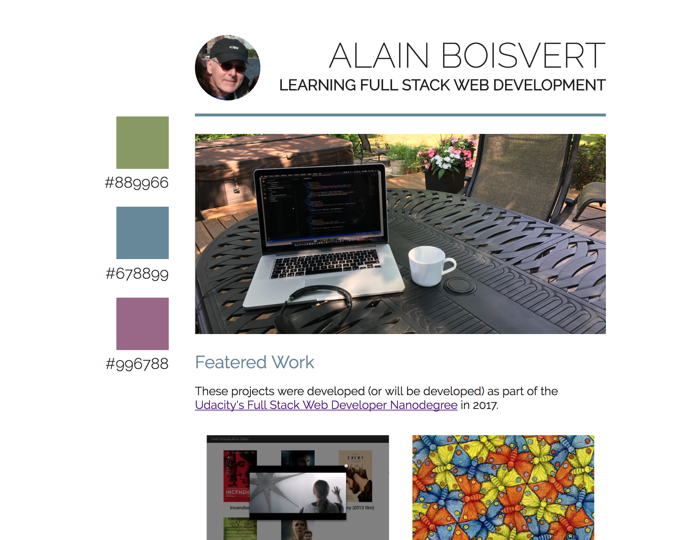

# Build a Portfolio Site
> Alain Boisvert, Québec, Canada, 2017-08-04 14:13 EDT. 

## Summary

Here is second project for the "Full Stack Web Developer Nanodegree".

This project involves converting PDF file to a Responsive Web Site. It was realy fun to replicate a PDF file in HTML and CSS. I think the result is very good

## How did I develop this code?

I first identified the four main rectangular areas of the PDF file.

I started this project from the compressed zip file "Project Part 1" from "Lesson 18: Starting Small".

I modified the HTML and CSS files from this project with [Visual Code Editor](https://code.visualstudio.com/),
by adding flexbox elements to the HTML file to reproduce the four main restangular areas
of the PDF file. I did the same with the three "featured work".

I have encountered a lot of difficulties with flexbox. 
These links have helped me better understand how flexbox works.
- [How To Get Started With CSS Flexbox](https://paulund.co.uk/css-flexbox)
- [Flexbox Cheatsheet Cheatsheet](http://jonibologna.com/content/images/flexboxsheet.pdf)
- [A Visual Guide to CSS3 Flexbox Properties](https://scotch.io/tutorials/a-visual-guide-to-css3-flexbox-properties)

When my web page finally appeared as the PDF file, then I reduced the size of the web browser and adjusted the dimension of my components with the instruction `@media screen and (max-width: ***px) {}`.

Normally I should have started with the small dimension of the Web page (as on a mobile phone) and then adjust for large screens, but the exercise we were asked was to start with a large image of a PDF file.

Finally, I validated my HTML and CSS files against the [W3C's Validators](https://validator.w3.org/).

I worked about ten hours to carry out this project.

## What did I learn?

I learned HTML and CSS in the early 2000s. But since the following technologies did not exist at that time, I had to work harder to understand them.

- Flexbox
- [HTML5 Semantic Elements](https://www.w3schools.com/html/html5_semantic_elements.asp) like header, section, article, footer, figure and figcaption.
- [Google Fonts](https://fonts.google.com)

## License

The contents of this repository are covered under the [MIT License](LICENSE).

