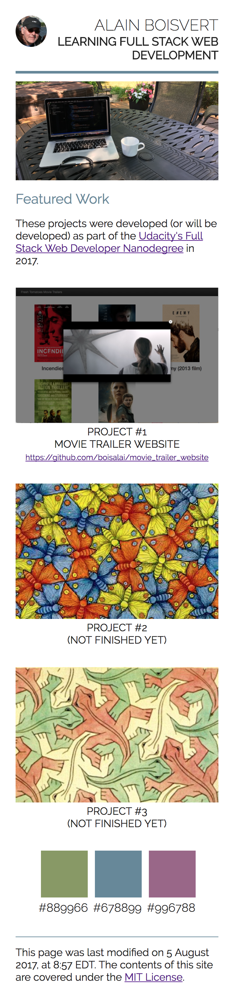
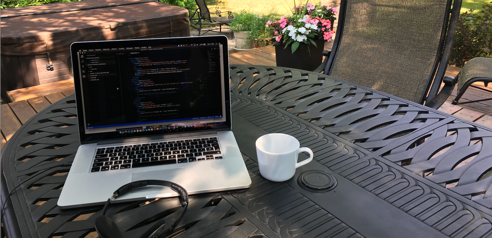

# Build a Portfolio Site
> Alain Boisvert, Québec, Canada, 2017-08-04 14:13 EDT.<br>
> Updated: See section [Changes made on August 5, 2017](#c1).

<a name="c1"></a>
## Changes made on August 5, 2017 after first review

Initially, the color palette was shown in the portfolio Web site like in mock up PDF, but it was 
not necessary.  But since I was making the color palette disappear on screen smaller than 900px (because it did not seem important to me to display the color palette on a small screen), I did not respect the rule that states "make sure all contents are visible on all screen sizes".

So to correct the problem, I could:
- simply eliminate the area on the right where only the color palette appeared;
- or move the color palette at the bottom of the web page on screen smaller than 900px.

I chose the second option which is the most difficult.

To do this, I slightly modified the CSS file and the HTML file.

First change. I removed the instruction that made disappear the color palette under 900px.

```css
@media screen and (max-width: 900px) {
  /* .content-left { display: none; } */
}
```

Then, I give the column direction to `.content` under 900px and I reverse the order of the zones. What 
appeared on the left (colors) and on the right (projects), now appear respectively
at the top (projects, order = 1) and at the bottom (colors, order = 2).

```css
@media screen and (max-width: 900px) {
  .content { 
    flex-direction: column; 
  }
  
  .content-left { 
    order: 2;
    width: 100%;
  }
  
  .content-right { 
    order: 1; 
  }
}
```

Then, I adjusted the presentation of the color palette for mobile devices like that:
horizontal row, justify on center, with left and right margins.

```css
@media screen and (max-width: 900px) {
  .color { 
    flex-direction: row; 
    justify-content: center;
    padding-right: 0; 
    margin: 16px 0;
  }

  .color-item {
    margin: 0px 4px;
  }
}
```

So that the "footer" part appears below the color palette on mobile devices, 
I have adjusted the "flexbox" in the HTML file to isolate the "footer" from the content at 
the bottom.



I believe now to respect the rule that all contents are visible on all screen sizes.

Also, I tried the suggestion to use `srcset` to tell browser to download the most optimized image size for different device / screen size. Here the code:

```html
<!--

-->

```

I am not sure that this image is optimized but this is for me a first try.

I made these adjustments this Saturday morning, it took about 2 hours.

Bye!

## Summary

Here is second project for the "Full Stack Web Developer Nanodegree".

This project involves converting PDF file to a Responsive Web Site. It was really fun to replicate a PDF file in HTML and CSS. I think the result is very good.


## How did I develop this code?

I first identified the four main rectangular areas of the PDF file.


I started this project from the compressed zip file "Project Part 1" from "Lesson 18: Starting Small".

I modified the HTML and CSS files from this project with [Visual Code Editor](https://code.visualstudio.com/),
by adding flexbox elements to the HTML file to reproduce the four main restangular areas
of the PDF file. I did the same with the three "featured work".

I have encountered a lot of difficulties with flexbox. 
These links have helped me better understand how flexbox works.
- [How To Get Started With CSS Flexbox](https://paulund.co.uk/css-flexbox)
- [Flexbox Cheatsheet Cheatsheet](http://jonibologna.com/content/images/flexboxsheet.pdf)
- [A Visual Guide to CSS3 Flexbox Properties](https://scotch.io/tutorials/a-visual-guide-to-css3-flexbox-properties)

When my web page finally appeared as the PDF file, then I reduced the size of the web browser and adjusted the dimension of my components with the instruction `@media screen and (max-width: ***px) {}`.

Normally I should have started with the small dimension of the Web page (as on a mobile phone) and then adjust for large screens, but the exercise we were asked was to start with a large image of a PDF file.

Finally, I validated my HTML and CSS files against the [W3C's Validators](https://validator.w3.org/).

I worked about ten hours to carry out this project.

## What did I learn?

I learned HTML and CSS in the early 2000s. But since the following technologies did not exist at that time, I had to work harder to understand them.

- Flexbox
- [HTML5 Semantic Elements](https://www.w3schools.com/html/html5_semantic_elements.asp) like header, section, article, footer, figure and figcaption.
- [Google Fonts](https://fonts.google.com)

## License

The contents of this repository are covered under the [MIT License](LICENSE).

